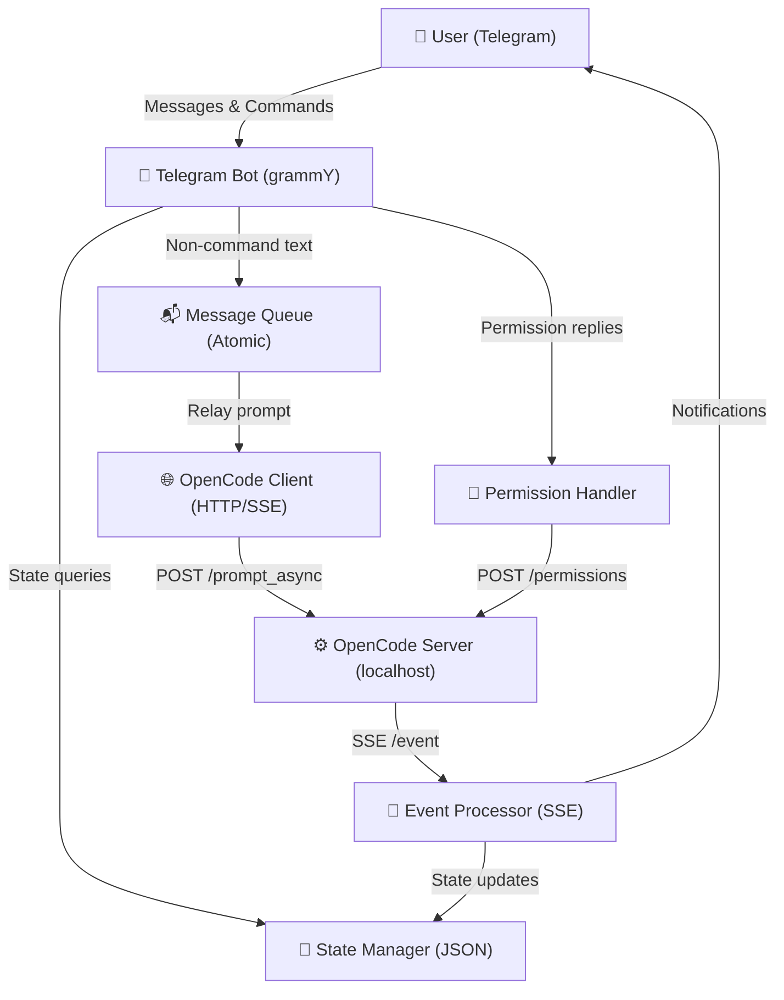
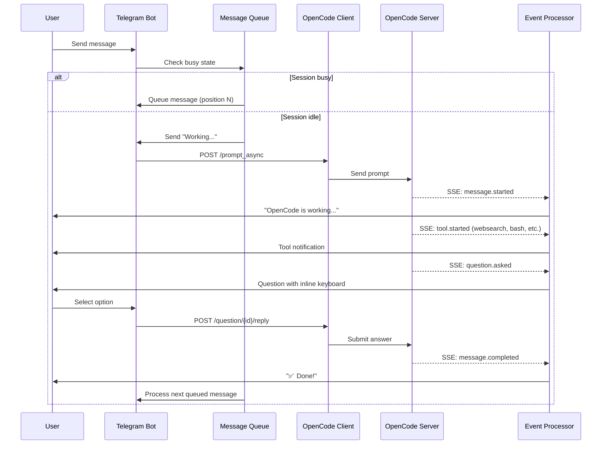
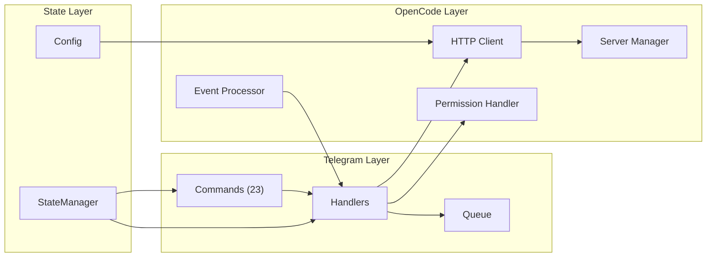

# OpenCode Telegram Bot

Control your [OpenCode](https://github.com/opencode-ai/opencode) server from Telegram. This bot acts as a relay between Telegram and your local OpenCode server, allowing you to prompt OpenCode, manage sessions, approve permissions, and monitor task execution directly from your phone or desktop.

## ✨ Features

- **Local-First**: Everything runs on your machine - no cloud, no tunnels, no remote exposure
- **Real-time Updates**: SSE-based event streaming for instant notifications
- **Session Management**: Create, list, switch between OpenCode sessions
- **Permission Handling**: Approve/reject file access and tool execution requests
- **Message Queueing**: Automatically queues multiple prompts when OpenCode is busy
- **Model/Mode Selection**: Choose AI providers, models, and modes (build/plan/review)
- **File Operations**: List files, view content, search code
- **Cost Tracking**: Monitor token usage and costs per session

## 🚀 Quick Start

### Prerequisites

- [Node.js](https://nodejs.org/) (v18 or higher)
- [OpenCode](https://github.com/opencode-ai/opencode) installed globally: `npm install -g opencode-ai`
- A Telegram account

### Installation

```bash
# Clone the repository
git clone https://github.com/vineetkishore01/Opencode-Telegram.git
cd Opencode-Telegram

# Install dependencies
npm install

# Build TypeScript
npm run build

# Install globally (may need sudo)
sudo npm install -g .
```

### First Run

Navigate to any project directory and run:

```bash
opencode-tele
```

The bot will guide you through setup:

1. **Telegram Bot Token**: Get from [@BotFather](https://t.me/botfather)
   - Send `/newbot` and follow instructions
   - Copy the token

2. **Your User ID**: Get from [@userinfobot](https://t.me/userinfobot)
   - Message @userinfobot on Telegram
   - Copy your numeric user ID

### What Happens on Startup

```
⏳ Starting OpenCode server...
✅ OpenCode server started on port 4097
🚀 Starting Telegram bot...
📡 Connecting to OpenCode at http://127.0.0.1:4097
✅ Telegram bot started as @yourbot

📱 You receive: "🚀 OpenCode is Online 🔥"
```

## 📖 Usage

### Basic Commands

```bash
opencode-tele                      # Start OpenCode + bot (local-only, no tunnel)
opencode-tele -d /path/to/project  # Start in specific directory
opencode-tele -p 5000              # Use different port
opencode-tele --tunnel             # Enable Cloudflare tunnel for remote access
opencode-tele --no-server          # Connect to existing OpenCode server
opencode-tele --uninstall          # Remove project config
```

### Command-Line Options

| Option | Description |
|--------|-------------|
| `-d, --directory <path>` | Project directory (default: current directory) |
| `-p, --port <port>` | OpenCode server port (default: 4097) |
| `--no-server` | Don't start OpenCode, connect to existing server |
| `--tunnel` | **Enable Cloudflare tunnel** (default: disabled, local-only) |
| `--uninstall` | Remove project configuration |
| `-h, --help` | Show help |

## 📱 Telegram Commands

### Session Commands

| Command | Description |
|---------|-------------|
| `/session` | Create a new OpenCode session |
| `/session <id>` | Select existing session by ID |
| `/sessions` | List 10 most recent sessions |
| `/status` | Show current session, model, and mode |
| `/abort` | Stop the currently running task |
| `/delete` | Delete current session |
| `/reset` | Reset relay tracking state |
| `/clear` | Clear session, model, and mode settings |

### Model Commands

| Command | Description |
|---------|-------------|
| `/providers` | List available AI providers |
| `/models <provider>` | List models for a provider |
| `/model <provider> <model>` | Select a specific model |

### Mode Commands

| Command | Description |
|---------|-------------|
| `/mode <name>` | Select mode (e.g., `build` or `plan`) |

### File Commands

| Command | Description |
|---------|-------------|
| `/files [path]` | List files in directory |
| `/file <path>` | View file content |
| `/find <pattern>` | Search code |

### Info Commands

| Command | Description |
|---------|-------------|
| `/cost` | Show token usage and cost |
| `/todo` | Show task list |
| `/diff` | Show file changes |
| `/help` | Show all commands |

## 🛠️ OpenCode Tools

OpenCode provides the LLM with built-in tools that are automatically available during sessions. The bot relays tool events to Telegram in real-time.

### Available Tools

| Tool | Icon | Description |
|------|------|-------------|
| `bash` | 🖥️ | Execute shell commands |
| `edit` | ✏️ | Modify existing files |
| `write` | 📝 | Create or overwrite files |
| `read` | 📖 | Read file contents |
| `grep` | 🔍 | Search file contents (regex) |
| `glob` | 🔍 | Find files by pattern |
| `list` | 📁 | List directory contents |
| `lsp` | 🔧 | LSP code intelligence (experimental) |
| `apply_patch` | 🩹 | Apply patches to files |
| `skill` | 🎓 | Load skill documentation |
| `todowrite` | 📋 | Manage todo lists |
| `webfetch` | 🌐 | Fetch web content from URLs |
| `websearch` | 🔎 | Search the web (Exa AI) |
| `question` | ❓ | Ask user questions (MCQs) |

### Web Search

OpenCode supports two web-related tools:

- **`websearch`**: Performs web searches using Exa AI. Useful for finding current information, researching topics, or gathering information beyond training data. Requires `OPENCODE_ENABLE_EXA=1` environment variable or using the OpenCode provider.
- **`webfetch`**: Fetches and reads content from specific URLs. Useful for looking up documentation or retrieving content from known sources.

To enable web search when starting the bot:

```bash
OPENCODE_ENABLE_EXA=1 opencode-tele
```

### Question Handling

When the LLM needs clarification or user input, it can ask questions via the `question` tool. The bot displays these as inline keyboards with:
- Option buttons for each choice
- A "Skip" button to dismiss the question
- Support for custom answers when no options are provided

Questions are displayed with a ❓ header and the question text.

## 🛠️ OpenCode Tools

OpenCode provides the LLM with built-in tools that are automatically available during sessions. The bot relays tool events to Telegram in real-time.

### Available Tools

| Tool | Icon | Description |
|------|------|-------------|
| `bash` | 🖥️ | Execute shell commands |
| `edit` | ✏️ | Modify existing files |
| `write` | 📝 | Create or overwrite files |
| `read` | 📖 | Read file contents |
| `grep` | 🔍 | Search file contents (regex) |
| `glob` | 🔍 | Find files by pattern |
| `list` | 📁 | List directory contents |
| `lsp` | 🔧 | LSP code intelligence (experimental) |
| `apply_patch` | 🩹 | Apply patches to files |
| `skill` | 🎓 | Load skill documentation |
| `todowrite` | 📋 | Manage todo lists |
| `webfetch` | 🌐 | Fetch web content from URLs |
| `websearch` | 🔎 | Search the web (Exa AI) |
| `question` | ❓ | Ask user questions (MCQs) |

### Web Search

OpenCode supports two web-related tools:

- **`websearch`**: Performs web searches using Exa AI. Useful for finding current information, researching topics, or gathering information beyond training data. Requires `OPENCODE_ENABLE_EXA=1` environment variable or using the OpenCode provider.
- **`webfetch`**: Fetches and reads content from specific URLs. Useful for looking up documentation or retrieving content from known sources.

To enable web search when starting the bot:

```bash
OPENCODE_ENABLE_EXA=1 opencode-tele
```

### Question Handling

When the LLM needs clarification or user input, it can ask questions via the `question` tool. The bot displays these as inline keyboards with:
- Option buttons for each choice
- A "Skip" button to dismiss the question
- Support for custom answers when no options are provided

Questions are displayed with a ❓ header and the question text.

### Quick Start Guide

1. **Create session**: Send `/session`
2. **Send prompt**: Just type any message (e.g., "create a todo app")
3. **Watch progress**: Receive real-time updates on thinking, tools, and completion
4. **Queue messages**: If busy, messages auto-queue with position notification

## 🔧 Architecture

### System Overview



### Event Flow



### Component Interactions



### Key Design Decisions

| Component | Implementation |
|-----------|----------------|
| **Event Stream** | SSE (Server-Sent Events) - no polling |
| **Server Management** | Bot starts/stops OpenCode automatically |
| **Network** | Localhost only - no tunnels, no remote access |
| **Message Queue** | Atomic enqueue to prevent race conditions |
| **Security** | Single authorized user, no multi-tenant support |
| **Question Handling** | Inline keyboards with option buttons + skip |
| **Permission Handling** | Inline keyboards with Once/Always/Reject |
| **Question Handling** | Inline keyboards with option buttons + skip |
| **Permission Handling** | Inline keyboards with Once/Always/Reject |

## ⚙️ Configuration

### Project Configuration

Stored in `.opencode-tele/` per project:

```
project/
├── .opencode-tele/
│   ├── config.json    # Bot token, user ID
│   ├── state.json     # Sessions, models, modes
│   └── bot.log        # Log file
```

### Environment Variables

Alternative to config files:

```bash
export TELEGRAM_BOT_TOKEN="your-bot-token"
export AUTHORIZED_USER_ID="your-user-id"
export OPENCODE_SERVER_URL="http://127.0.0.1:4097"
export LOG_LEVEL="info"
```

### OpenCode Pure Mode (Default)

By default, the bot starts OpenCode with `--pure` flag to disable:
- Push notifications via cloud tunnels
- External plugins
- Remote access features

This ensures everything stays local on `127.0.0.1`.

### Enabling Remote Access (Optional)

If you need remote access, use the `--tunnel` flag:

```bash
opencode-tele --tunnel
```

This starts OpenCode **without** `--pure`, allowing it to create Cloudflare tunnels for remote access.

⚠️ **Security Warning**: Only use `--tunnel` if you:
- Understand the security implications
- Need remote access from outside your network
- Trust the OpenCode push notification system

## 🛑 Shutdown Behavior

Press `Ctrl+C` to stop:

```
🔴 Stopping services...
[OpenCode server stopped]
[Telegram bot stopped]
✅ Goodbye!

📱 You receive: "🔴 OpenCode is going down 🔥"
```

## 🐛 Troubleshooting

### Port Already in Use

```bash
# Use a different port
opencode-tele -p 5000

# Or stop existing server first
lsof -ti:4097 | xargs kill
```

### OpenCode Not Installed

```bash
npm install -g opencode-ai
opencode --version  # Verify
```

### Bot Not Responding

1. Check logs: `cat .opencode-tele/bot.log`
2. Verify bot token with [@BotFather](https://t.me/botfather)
3. Ensure your user ID matches config

### SSE Connection Failed

If you see `SSE connection failed` in logs:
- This is normal if OpenCode doesn't support SSE
- Bot will still work via HTTP requests
- Events won't be real-time but will be processed

### Session Stuck

```bash
# In Telegram
/abort   # Stop current task
/clear   # Clear session state
/session # Create new session
```

## 📝 Logging

Logs written to `.opencode-tele/bot.log`:

```bash
# View logs
tail -f .opencode-tele/bot.log

# Set log level
export LOG_LEVEL=debug
```

Levels: `debug` | `info` | `warn` | `error`

## 🧹 Uninstallation

```bash
# Remove global command
sudo npm uninstall -g opencode-tele

# Clean project configs
opencode-tele --uninstall

# Or manually remove
rm -rf .opencode-tele/
```

## 🏗️ Development

```bash
# Install dependencies
npm install

# Build
npm run build

# Run in development mode
npm run dev

# Type check
npm run typecheck
```

## 📦 Project Structure

```
src/
├── bot/
│   ├── commands.ts      # Telegram commands
│   ├── handlers.ts      # Message handlers
│   ├── index.ts         # TelegramBot class
│   └── queue.ts         # Message queue (atomic operations)
├── opencode/
│   ├── client.ts        # HTTP client with SSE
│   ├── events.ts        # Event processor
│   ├── permission.ts    # Permission handling
│   └── server.ts        # OpenCode server management
├── state/
│   └── manager.ts       # State persistence
├── utils/
│   ├── config.ts        # Configuration
│   ├── formatter.ts     # Telegram formatting
│   └── logger.ts        # Logging
├── types/
│   └── index.ts         # TypeScript types
└── index.ts             # CLI entry point
```

## 🤝 Contributing

Contributions welcome! Please:

1. Open an issue to discuss the change
2. Fork and create a PR
3. Ensure tests pass

## 📜 License

MIT License

## 🙏 Acknowledgments

- [OpenCode](https://github.com/opencode-ai/opencode) - AI coding CLI
- [grammy](https://grammy.dev/) - Telegram Bot framework
- [@BotFather](https://t.me/botfather) - Telegram bot creation
