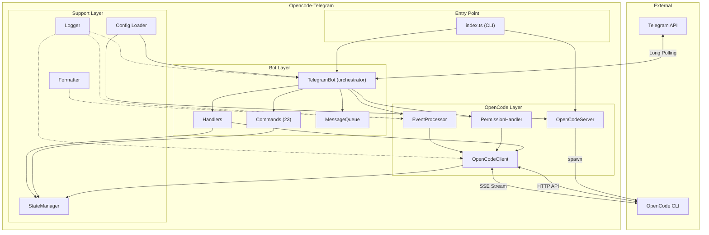
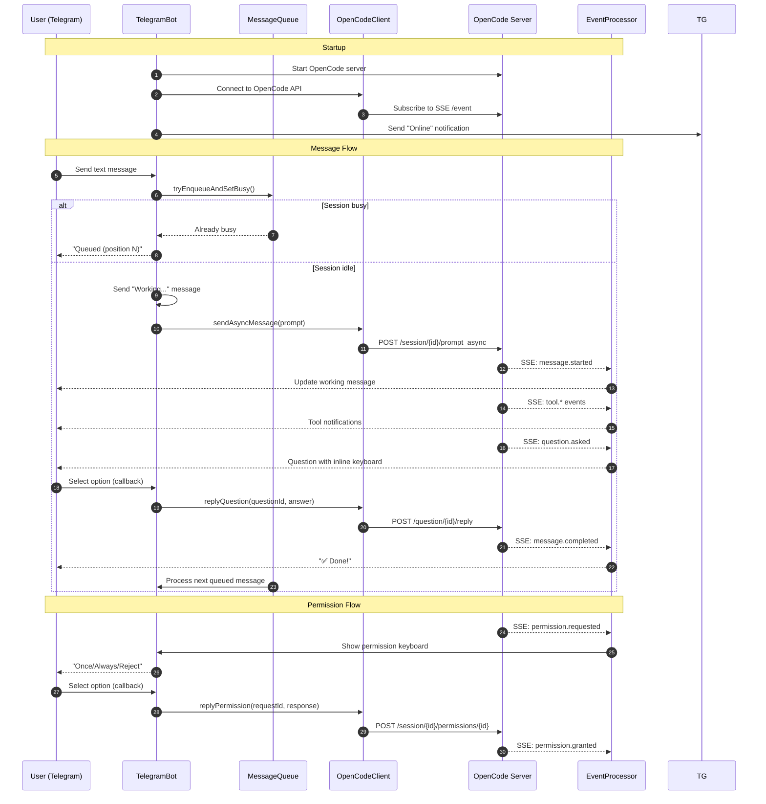
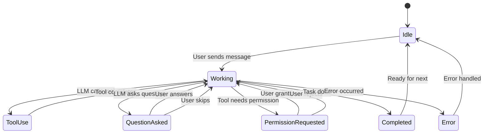

# Development Documentation

## Architecture Overview

This project bridges Telegram with OpenCode's HTTP server, providing a real-time, event-driven interface for AI coding assistance.

### System Architecture



### Event Flow Diagram



### State Management Flow



## Project Structure

```
src/
├── index.ts                   # CLI entry point
│                               - Parses CLI args
│                               - Runs interactive setup if needed
│                               - Starts OpenCode server (optional)
│                               - Creates and starts TelegramBot
│                               - Handles graceful shutdown
│
├── bot/
│   ├── index.ts               # TelegramBot class (orchestrator)
│   │                           - Composes all subsystems
│   │                           - Registers commands and handlers
│   │                           - Manages lifecycle (start/stop)
│   │
│   ├── commands.ts            # All /commands (23 commands)
│   │                           - Session management
│   │                           - Model/provider selection
│   │                           - Mode selection
│   │                           - File operations
│   │                           - Info/cost tracking
│   │
│   ├── handlers.ts            # Message + callback handlers
│   │                           - Text message relay to OpenCode
│   │                           - Callback query handling (permissions, questions, sessions)
│   │                           - Authorization checks
│   │
│   └── queue.ts               # Atomic message queue
│                               - Per-chat queue with atomic operations
│                               - Prevents race conditions
│                               - Persists to state file
│
├── opencode/
│   ├── client.ts              # HTTP client (native http/https, SSE)
│   │                           - Sessions CRUD
│   │                           - Message sending (sync/async)
│   │                           - Model/provider listing
│   │                           - Permission replies
│   │                           - Question replies
│   │                           - File operations
│   │                           - SSE subscription
│   │
│   ├── events.ts              # SSE event processor
│   │                           - Real-time event handling
│   │                           - Session state tracking
│   │                           - Outgoing message queue with rate limiting
│   │                           - Event type handlers:
│   │                             • session.created/started
│   │                             • message.created/started/completed
│   │                             • message.part.created/updated
│   │                             • permission.requested
│   │                             • question.asked
│   │                             • tool.started/completed
│   │                             • step.started
│   │                             • error
│   │
│   ├── permission.ts          # Permission request handler
│   │                           - Sends inline keyboard (Once/Always/Reject)
│   │                           - Handles permission replies
│   │
│   └── server.ts              # Spawns/manages `opencode serve`
│                               - 60-second startup timeout
│                               - Graceful shutdown (SIGTERM -> SIGKILL)
│                               - Pure mode (--pure flag)
│                               - Tunnel mode (--tunnel flag)
│
├── state/
│   └── manager.ts             # Persistent state (JSON file)
│                               - Current session per chat
│                               - Selected model/provider
│                               - Selected mode
│                               - Prompt counts
│                               - Atomic writes (tmp + rename)
│
├── types/
│   └── index.ts               # Zod schemas + TypeScript interfaces
│                               - OpenCode API types
│                               - Event types
│                               - Bot state types
│                               - Config types
│
└── utils/
    ├── config.ts              # Config loading/validation
    │                           - Env vars or project config files
    │                           - Zod validation
    │
    ├── formatter.ts           # Markdown escaping, message splitting
    │                           - Telegram Markdown compliance
    │                           - Message chunking for length limits
    │                           - File icon mapping
    │
    └── logger.ts              # File + console logger
                                - Multiple log levels
                                - File output to .opencode-tele/bot.log
```

## Development Workflow

### Setup
```bash
npm install
```

### Running in Development
```bash
# Uses tsx to run source directly
npm run dev
```

### Building
```bash
# Compiles TypeScript to JavaScript in dist/
npm run build
```

### Testing
```bash
# Run unit tests
npm test
```

### Local Global Test
```bash
npm run build
sudo npm install -g .
```

## Implementation Notes

### Networking
- Uses Node.js's native `http` module instead of `fetch` or `undici` for maximum compatibility
- 30-second request timeout
- Basic Auth support for protected OpenCode servers

### Event Handling
- SSE (Server-Sent Events) for real-time updates
- No polling - events are pushed from OpenCode
- Per-session state tracking
- Rate-limited outgoing messages (500ms delay)
- Telegram 429 rate limit handling with exponential backoff

### Message Queue
- Atomic `tryEnqueueAndSetBusy()` prevents race conditions
- Per-chat queue with position tracking
- Persisted to state file for recovery
- Processes next message automatically on completion

### Security
- Single authorized user only
- Authorization checked on every message and callback
- Localhost-only by default (--pure mode)
- Optional Cloudflare tunnel (--tunnel flag)

### State Persistence
- JSON file at `.opencode-tele/state.json`
- Atomic writes (write to .tmp then rename)
- Tracks sessions, models, modes, prompt counts
- Queue state recovery on startup

## Key Patterns

### Event Processing
```
SSE Event → handleEvent() → switch(type) → specific handler → queueMessage() → processOutgoingQueue()
```

### Message Flow
```
User Message → Authorization Check → Session Check → Queue Check → Send to OpenCode → Track State
```

### Permission Flow
```
permission.requested Event → PermissionHandler → Inline Keyboard → User Selection → replyPermission() → Continue
```

### Question Flow
```
question.asked Event → handleQuestionAsked() → Inline Keyboard with Options → User Selection → replyQuestion() → Continue
```

## Event Types Handled

| Event Type | Handler | Description |
|------------|---------|-------------|
| `session.created` | `handleSessionStarted` | Session ready for messages |
| `session.started` | `handleSessionStarted` | Session ready for messages |
| `message.created` | `handleMessageStarted` | Mark session as working |
| `message.started` | `handleMessageStarted` | Mark session as working |
| `message.part.created` | `handleMessagePartCreated` | Text/reasoning/file parts |
| `message.part.updated` | `handleMessagePartUpdated` | Text updates |
| `message.completed` | `handleMessageCompleted` | Task done, process queue |
| `session.completed` | `handleSessionIdle` | Session idle, process queue |
| `session.idle` | `handleSessionIdle` | Session idle, process queue |
| `permission.requested` | `handlePermissionRequested` | Show permission keyboard |
| `question.asked` | `handleQuestionAsked` | Show question with options |
| `tool.started` | `handleToolEvent` | Tool execution started |
| `tool.completed` | `handleToolEvent` | Tool execution completed |
| `step.started` | `handleStepStarted` | New step started |
| `error` | `handleError` | Error notification |

## Configuration

### Environment Variables
```bash
TELEGRAM_BOT_TOKEN=your-bot-token
AUTHORIZED_USER_ID=your-user-id
OPENCODE_SERVER_URL=http://127.0.0.1:4097
OPENCODE_ENABLE_EXA=1  # Enable web search
LOG_LEVEL=info
```

### Project Config
```json
{
  "telegramToken": "your-bot-token",
  "authorizedUserId": "your-user-id"
}
```

### State File
```json
{
  "sessions": { "123456789": "session-id" },
  "models": { "123456789": { "providerId": "openai", "modelId": "gpt-4" } },
  "modes": { "123456789": "build" },
  "promptCounts": { "123456789": 5 }
}
```
